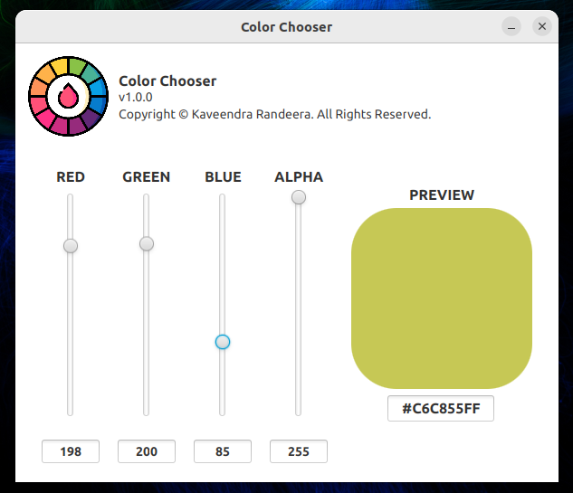
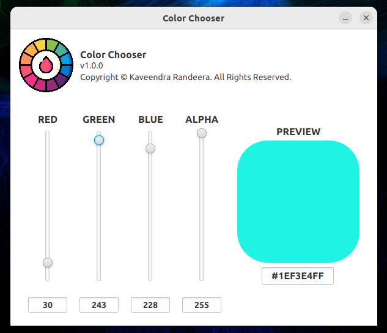
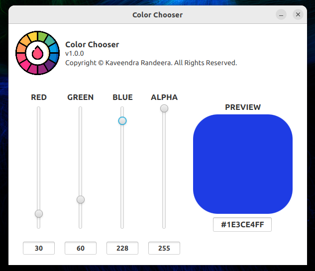
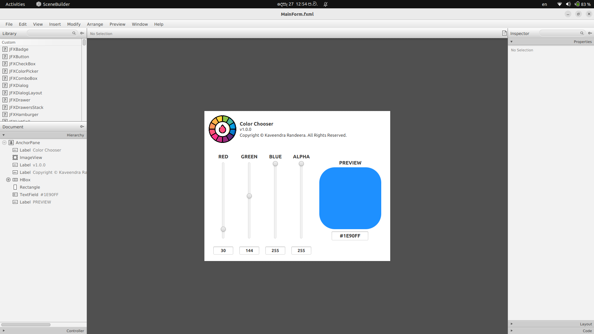

# Color Chooser App

The Color Chooser App is a simple desktop application developed using Java and JavaFX. This application allows users to interactively select colors by adjusting the RGB values and opacity using sliders. The color square in the app updates in real-time to reflect the total RGBA and opacity values chosen by the user.

## Features

- Intuitive sliders for adjusting RGB values (0-255).
- Slider for adjusting opacity (0-255).
- Real-time update of the color square based on user input.

## Images





## Getting Started

To run the Color Chooser App, make sure you have Java SE and JavaFX installed. Follow these steps:

1. **Clone the Repository:**
   ```bash
   git clone https://github.com/randeera/desktop-color-chooser-app.git

2. **Navigate to the Project Directory:**
   ```bash
   cd desktop-color-chooser-app

3. **Open the Project in Your Favorite Java IDE (e.g., IntelliJ, Eclipse):**
4. **Add dependencies via prom.xml using maven rebuild:**

5. **Run the App:**
    ```bash
    Locate the AppInitializerWrapper and run it

## Technologies Used
- Java
- JavaFX
- JavaSE
- SceneBuilder

## Contributing
Contributions are welcome! If you find any bugs or have suggestions for improvement, please open an issue or submit a pull request.

## License
This project is licensed under the MIT License